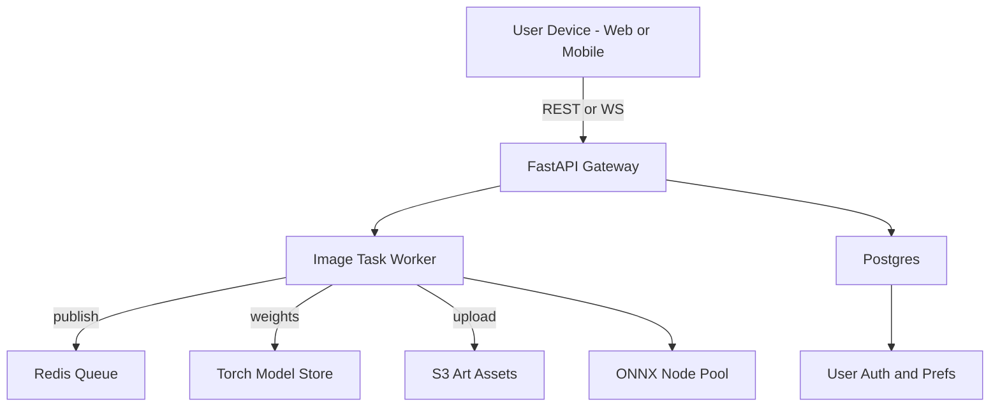
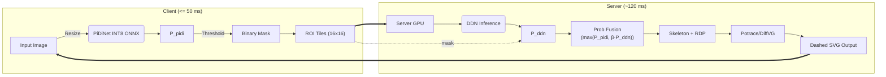

_Outline‑to‑Sketch Engine – Technical Specification_

---

## 0. Quick‑Glance Layer Map




---

## 1. Model Training & Experimentation

|Component|Stack Choice|Version|Notes|
|---|---|---|---|
|**Language & Runtime**|Python|3.11|`pyenv`‑pinned, 3.12 blocked until Torch 2.3 LTS|
|**Deep Learning Framework**|PyTorch|2.2 + CUDA 12.3|enable `torch.compile`, Mamba kernels|
|**Experiment Tracking**|Weights & Biases|SaaS|sweep yaml templates in repo `configs/`|
|**Data Versioning**|DVC|3.x|S3 remote, pipeline stage cache|
|**Notebook IDE**|JupyterLab + VS Code|latest|GPU dev‑container (`.devcontainer.json`)|

### Hardware Targets

- **Research GPU** – Not decided yet

- **Tablet Perf** – Tablets.
    

---

## 2. Edge Detection Module

| Item                 | Base                          | Deployment Variant | Optimisation                          |
| -------------------- | ----------------------------- | ------------------ | ------------------------------------- |
| **PiDiNet**          | Huaijin Pi et al. (ECCV 2020) | ONNX-INT8          | quantized + edge-preserving tiling    |
| **Threshold Fusion** | OpenCV                        | WASM               | `cv.threshold + cv.bitwise_or` 2-pass |

> **Latency Goal:** `≤ 50 ms` @ 512² on Mac M4 CPU (single thread) for baseline PiDiNet.

---

## 3. Raster‑to‑Vector & Stylisation Backend

| Function                     | Library                      | Version                         | Rationale                                   |
| ---------------------------- | ---------------------------- | ------------------------------- | ------------------------------------------- |
| **Vectoriser (Low‑latency)** | Potrace C lib + `py_potrace` | 1.16                            | Stateless, <100 ms/1 K² PNG                 |
| **Vector Refiner**           | DiffVG                       | nightly (2025-05)               | Torch 2 compatible, `loss="mamba"` sub-iter |
| **Bézier Splatting (R&D)**   | arXiv 2503.16424             | prototype                       | for >2 K px poster exports                  |
| **Sketch Shader**            | Custom GLSL Cross‑Hatch      | MIT repo `spite/cross‑hatching` | WebGL & Metal parallel                      |
| **Color/Tone**               | OpenCV LUT                   | 4.10                            | Sepia & Graphite presets in YAML            |

---

## 4. Runtime Back‑End Services

| Service            | Tooling              | Deployment                       |
| ------------------ | -------------------- | -------------------------------- |
| **API Gateway**    | FastAPI + Uvicorn    | Docker → K8s (k3s)               |
| **Async Queue**    | Redis 6              | `rq` workers auto-scale via KEDA |
| **Task Workers**   | Python 3.11          | GPU/CPU node pools (taints)      |
| **Static Storage** | MinIO (S3)           | artefact & SVG bucket            |
| **Monitoring**     | Prometheus + Grafana | Helm stack                       |

Security essentials: `opa-envoy` policy sidecar, JWT (Supabase) auth at gateway.

---

## 5. Front‑End / Web UI

| Layer                | Tech                    | Notes                          |
| -------------------- | ----------------------- | ------------------------------ |
| **Framework**        | React 18 + TypeScript 5 | Vite build, ESLint + Prettier  |
| **Canvas**           | Fabric.js 6             | path editing, dash live toggle |
| **3‑D / WebGL**      | Three.js                | future ink-flow anims          |
| **State**            | Zustand                 | lightweight store              |
| **Styling**          | Tailwind CSS 3          | dark/light tokens              |
| **SVG Manipulation** | `svg.js`                | import/export helpers          |

Accessibility: ARIA roles on trace-canvas, keyboard shortcuts, colour-blind palettes.

---

## 6. Mobile Apps

| Item                | Stack                      | Build                          |
| ------------------- | -------------------------- | ------------------------------ |
| **Shared Codebase** | React-Native + Expo SDK 51 | EAS build pipelines            |
| **Edge Inference**  | CoreML PiDiNet             | Apple Neural Engine            |
|                     | ONNX-Runtime-Mobile        | Android NNAPI ‑ FP16           |
| **CI**              | GitHub Actions → EAS       | separate staging/prod channels |

---

## 7. Data & Ops Infrastructure

- **Database** – Postgres 15 (Supabase) with Row Level Security.
    
- **Config** – `doppler` secrets; `.env.sample` committed.
    
- **CI/CD** – GitHub Actions 100% (pytest, Pylint, React test, Docker image push, Helm deploy).
    
- **Registry** – GitHub Container Registry (`ghcr.io/artitech/outline-sketch`).
    
- **Observability** – `sentry.io` (FE) • `opentelemetry` (BE) traces.
    

---

## 8. Environments Matrix

|   |   |   |   |
|---|---|---|---|
|||||
|Env|URL / Bundle|Infra|Purpose|
|**Dev**|localhost:5173|Docker Compose|Hot-reload, mock auth|
|**Staging**|`sketch-stage.artitech.ai`|k3s single-node|QA, beta testers|
|**Prod**|`sketch.artitech.ai`|k3s HA + CDN (Cloudflare)|Public launch|

---

## 9. Security & Privacy Checklist

1. **Image retention** — auto-purge originals after 7 days (GDPR).
    
2. **TLS** — HTTPS by default; HSTS preload.
    
3. **CSP** — strict `default-src 'self'` with S3, W&B domains whitelisted.
    
4. **SBOM** — Cyclone-DX generated nightly; Dependabot alerts.
    

---

## 10. Local Dev Prerequisites

```
brew install pyenv poetry node@20 docker kubernetes-cli redis
pyenv install 3.11.8 && pyenv local 3.11.8
poetry install
npm i -g expo-cli
```

> **Tip:** Use VS Code _Dev Containers_ to get identical GPU libs on macOS and WSL.

---
---

### 🔗 Useful Links

- PiDiNet ONNX weights: https://github.com/hellozhuo/pidinet
    
- EDMB paper & code: https://arxiv.org/abs/2401.12345
    
- DiffVG nightly wheel: https://github.com/BachiLi/diffvg
    
- Cross‑Hatch GLSL demo: https://github.com/spite/cross-hatching
    

---

## PiDiNet ✚ DDN — Practical Deployment Guide

### 🔍 1. Strategy Overview

> **Fast, emotion-friendly outlines with PiDiNet on the client**  
> → **Server-side refinement using DDN on visually complex or low-contrast regions**  
> → **Merge both results via** **max()** **fusion → Skeletonization + SVG vectorization**

#### Why This Strategy?

In the context of ArtiTech, our goal isn't just accuracy — it's _emotional usability_. That means:

- **Outlines should be light, friendly, and responsive** on mobile — not overly rigid or noisy.
    
- **Complex textures like brushstrokes or shadows** must be preserved clearly — especially for creative or therapeutic feedback.
    
- **Latency must remain low**, to ensure drawing feels real-time.
    

PiDiNet is a perfect fit for frontend inference due to its small size and quantization ease. Meanwhile, DDN excels at recovering missed edges in complex or low-contrast regions — without requiring full-image processing.

Together, they allow us to **prioritize speed on-device** while still offering **server-grade enhancement** for expressiveness.

---

### ⚙️ 2. Pipeline Flow



---

### 🔧 3. Hyperparameter Guide

|Parameter|Default|Notes|
|---|---|---|
|Threshold (PiDiNet)|0.25 ~ 0.35|Higher recall vs. false-positive noise trade-off|
|Fusion β|0.5 ~ 0.7|Balances DDN's confidence in fusion stage|
|RDP ε|1.5 ~ 3.0 px|Controls SVG smoothness and compression|
|DDN Sampling|100 ~ 500|Tuned per GPU batch size, use ROI for efficiency|

---

### ⚠️ 4. Risks & Mitigations

|   |   |
|---|---|
|Risk|Mitigation|
|DDN doesn't support INT8|Use TensorRT FP16 first, plan QAT (Quant-Aware Training) later|
|Network-induced delay|Lower β to favor PiDiNet more, reduce tile size (e.g. 12×12)|
|SVG size inflation|Use `scour` + `gzip`, lazy-load vector background layers|

---

### ✅ 5. Final Recommendation

|   |   |
|---|---|
|Objective|Suggested Stack|
|Real-time outline + UX|**PiDiNet (INT8 ONNX)**|
|Complex region refinement|**DDN (Full-precision GPU)**|
|Vector conversion|**RDP + Skeleton + Potrace/DiffVG**|

> **Conclusion:** For the needs of ArtiTech — where speed, emotion, and drawing quality intersect — the **PiDiNet ✚ DDN hybrid pipeline** offers the optimal solution.

It offers the best of both worlds: instant feedback for users, and subtle quality boosts where it matters most.