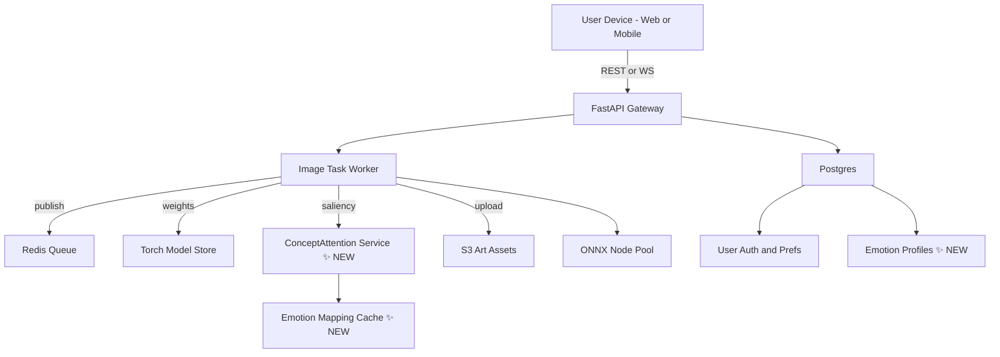
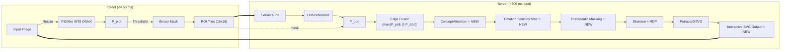

_Outline‑to‑Sketch Engine – Technical Specification + Saliency Integration_

---

## 0. Quick‑Glance Layer Map - **UPDATED**




---

## 1. Model Training & Experimentation - **UPDATED**

|Component|Stack Choice|Version|Notes|
|---|---|---|---|
|**Language & Runtime**|Python|3.11|`pyenv`‑pinned, 3.12 blocked until Torch 2.3 LTS|
|**Deep Learning Framework**|PyTorch|2.2 + CUDA 12.3|enable `torch.compile`, Mamba kernels, **ConceptAttention support** ✨|
|**Saliency Framework** ✨ **NEW**|**ConceptAttention**|**latest**|**DiT backbone, emotion-concept mapping, 150-250ms processing** ✨|
|**Experiment Tracking**|Weights & Biases|SaaS|sweep yaml templates in repo `configs/`, **emotion accuracy tracking** ✨|
|**Data Versioning**|DVC|3.x|S3 remote, pipeline stage cache, **emotion-labeled datasets** ✨|
|**Notebook IDE**|JupyterLab + VS Code|latest|GPU dev‑container (`.devcontainer.json`), **saliency experimentation** ✨|

### Hardware Targets - **UPDATED**

- **Research GPU** – RTX 4090 / A100 (**required for ConceptAttention training** ✨)

- **Production Server** – NVIDIA GPU with 8GB+ VRAM (**for saliency processing** ✨)

- **Mobile/Tablet Perf** – Tablets with CoreML optimization (**for basic emotion detection** ✨).
    

---

## 2. Edge Detection Module - **UPDATED**

| Item                 | Base                          | Deployment Variant | Optimisation                          |
| -------------------- | ----------------------------- | ------------------ | ------------------------------------- |
| **PiDiNet**          | Huaijin Pi et al. (ECCV 2020) | ONNX-INT8          | quantized + edge-preserving tiling    |
| **ConceptAttention** ✨ **NEW** | **DiT-based saliency** | **ONNX-FP16** | **emotion-guided concept detection** ✨ |
| **Threshold Fusion** | OpenCV                        | WASM               | `cv.threshold + cv.bitwise_or` 2-pass |
| **Emotion Mapping** ✨ **NEW** | **Custom logic** | **Python** | **fast concept-to-prompt translation** ✨ |

> **Latency Goal:** `≤ 50 ms` @ 512² on Mac M4 CPU (single thread) for baseline PiDiNet + `≤ 250ms` **for saliency processing** ✨.

---

## 3. Raster‑to‑Vector & Stylisation Backend - **UPDATED**

| Function                     | Library                      | Version                         | Rationale                                   |
| ---------------------------- | ---------------------------- | ------------------------------- | ------------------------------------------- |
| **Vectoriser (Low‑latency)** | Potrace C lib + `py_potrace` | 1.16                            | Stateless, <100 ms/1 K² PNG                 |
| **Vector Refiner**           | DiffVG                       | nightly (2025-05)               | Torch 2 compatible, `loss="mamba"` sub-iter |
| **Saliency Processor** ✨ **NEW** | **ConceptAttention** | **latest** | **emotion-based region detection** ✨ |
| **Emotion Masker** ✨ **NEW** | **Custom NumPy** | **latest** | **therapeutic outline generation** ✨ |
| **Bézier Splatting (R&D)**   | arXiv 2503.16424             | prototype                       | for >2 K px poster exports                  |
| **Sketch Shader**            | Custom GLSL Cross‑Hatch      | MIT repo `spite/cross‑hatching` | WebGL & Metal parallel                      |
| **Color/Tone**               | OpenCV LUT                   | 4.10                            | Sepia & Graphite presets in YAML            |

---

## 4. Runtime Back‑End Services - **UPDATED**

| Service            | Tooling              | Deployment                       |
| ------------------ | -------------------- | -------------------------------- |
| **API Gateway**    | FastAPI + Uvicorn    | Docker → K8s (k3s)               |
| **Async Queue**    | Redis 6              | `rq` workers auto-scale via KEDA |
| **Task Workers**   | Python 3.11          | GPU/CPU node pools (taints)      |
| **Saliency Service** ✨ **NEW** | **Python + ConceptAttention** | **GPU-optimized pods** ✨ |
| **Emotion Cache** ✨ **NEW** | **Redis + Custom logic** | **Fast concept lookup** ✨ |
| **Static Storage** | MinIO (S3)           | artefact & SVG bucket            |
| **Monitoring**     | Prometheus + Grafana | Helm stack                       |

Security essentials: `opa-envoy` policy sidecar, JWT (Supabase) auth at gateway, **emotion data protection** ✨.

---

## 5. Front‑End / Web UI - **UPDATED**

| Layer                | Tech                    | Notes                          |
| -------------------- | ----------------------- | ------------------------------ |
| **Framework**        | React 18 + TypeScript 5 | Vite build, ESLint + Prettier  |
| **Canvas**           | Fabric.js 6             | path editing, dash live toggle |
| **Emotion Interface** ✨ **NEW** | **Custom React components** | **emotion selection, intensity sliders** ✨ |
| **Therapeutic Progress** ✨ **NEW** | **React hooks + local storage** | **completion tracking, emotional feedback** ✨ |
| **3‑D / WebGL**      | Three.js                | future ink-flow anims          |
| **State**            | Zustand                 | lightweight store              |
| **Styling**          | Tailwind CSS 3          | dark/light tokens              |
| **SVG Manipulation** | `svg.js`                | import/export helpers          |

Accessibility: ARIA roles on trace-canvas, keyboard shortcuts, colour-blind palettes, **emotion accessibility** ✨.

---

## 6. Mobile Apps - **UPDATED**

| Item                | Stack                      | Build                          |
| ------------------- | -------------------------- | ------------------------------ |
| **Shared Codebase** | React-Native + Expo SDK 51 | EAS build pipelines            |
| **Edge Inference**  | CoreML PiDiNet             | Apple Neural Engine            |
| **Saliency Inference** ✨ **NEW** | **CoreML ConceptAttention** | **Apple Neural Engine + GPU** ✨ |
| **Emotion Processing** ✨ **NEW** | **On-device logic** | **Fast concept mapping** ✨ |
|                     | ONNX-Runtime-Mobile        | Android NNAPI ‑ FP16           |
| **CI**              | GitHub Actions → EAS       | separate staging/prod channels |

---

## 7. Data & Ops Infrastructure - **UPDATED**

- **Database** – Postgres 15 (Supabase) with Row Level Security + **emotion profile tables** ✨.
    
- **Config** – `doppler` secrets; `.env.sample` committed + **emotion mapping configs** ✨.
    
- **CI/CD** – GitHub Actions 100% (pytest, Pylint, React test, Docker image push, Helm deploy, **saliency model validation** ✨).
    
- **Registry** – GitHub Container Registry (`ghcr.io/artitech/outline-sketch`) + **saliency models** ✨.
    
- **Observability** – `sentry.io` (FE) • `opentelemetry` (BE) traces + **emotion processing metrics** ✨.
    

---

## 8. Environments Matrix - **UPDATED**

|   |   |   |   |
|---|---|---|---|
|||||
|Env|URL / Bundle|Infra|Purpose|
|**Dev**|localhost:5173|Docker Compose + **saliency mock** ✨|Hot-reload, mock auth, **emotion testing** ✨|
|**Staging**|`sketch-stage.artitech.ai`|k3s single-node + **GPU support** ✨|QA, beta testers, **therapeutic validation** ✨|
|**Prod**|`sketch.artitech.ai`|k3s HA + CDN (Cloudflare) + **GPU cluster** ✨|Public launch, **full therapeutic features** ✨|

---

## 9. Security & Privacy Checklist - **UPDATED**

1. **Image retention** — auto-purge originals after 7 days (GDPR).

2. **Emotion data protection** ✨ — **Encrypt emotion profiles, anonymize saliency data, therapeutic privacy compliance** ✨.
    
3. **TLS** — HTTPS by default; HSTS preload.
    
4. **CSP** — strict `default-src 'self'` with S3, W&B domains whitelisted + **ConceptAttention API endpoints** ✨.
    
5. **SBOM** — Cyclone-DX generated nightly; Dependabot alerts + **saliency model security scanning** ✨.
    

---

## 10. Local Dev Prerequisites - **UPDATED**

```
brew install pyenv poetry node@20 docker kubernetes-cli redis
pyenv install 3.11.8 && pyenv local 3.11.8
poetry install
npm i -g expo-cli

# NEW: ConceptAttention setup ✨
pip install diffusers transformers accelerate
# Download ConceptAttention weights
```

> **Tip:** Use VS Code _Dev Containers_ to get identical GPU libs + **ConceptAttention dependencies** ✨ on macOS and WSL.

---
---

### 🔗 Useful Links - **UPDATED**

- PiDiNet ONNX weights: https://github.com/hellozhuo/pidinet
    
- **ConceptAttention repository** ✨: https://github.com/helblazer811/ConceptAttention
    
- EDMB paper & code: https://arxiv.org/abs/2401.12345
    
- DiffVG nightly wheel: https://github.com/BachiLi/diffvg
    
- Cross‑Hatch GLSL demo: https://github.com/spite/cross-hatching
    
- **Therapeutic art technology research** ✨: (Links to art therapy resources)

---

## PiDiNet ✚ DDN ✚ ConceptAttention — **Therapeutic Deployment Guide** ✨ **UPDATED**

### 🔍 1. Strategy Overview - **ENHANCED**

> **Fast, emotion-friendly outlines with PiDiNet on the client**  
> → **Server-side refinement using DDN on visually complex or low-contrast regions**  
> → **ConceptAttention emotion-based saliency analysis** ✨  
> → **Therapeutic partial outline generation with selective masking** ✨  
> → **Merge all results via adaptive fusion → Interactive SVG for therapeutic drawing**

#### Why This Enhanced Strategy?

In the context of ArtiTech's therapeutic goals, our enhanced pipeline provides:

- **Outlines should be light, friendly, and responsive** on mobile — not overly rigid or noisy.
    
- **Complex textures like brushstrokes or shadows** must be preserved clearly — especially for creative or therapeutic feedback.

- **Emotion-based interaction** ✨ — Hide or highlight specific regions based on user's emotional state and therapeutic goals.
    
- **Latency must remain acceptable**, to ensure drawing feels engaging (<300ms total pipeline).

- **Therapeutic value** ✨ — Guide users to focus on specific emotional elements through strategic masking.
    

PiDiNet provides fast frontend inference, DDN enhances complex regions, and **ConceptAttention adds emotional intelligence for therapeutic applications** ✨.

---

### ⚙️ 2. Enhanced Pipeline Flow ✨ **UPDATED**



---

### 🔧 3. Hyperparameter Guide - **UPDATED**

|Parameter|Default|Notes|
|---|---|---|
|Threshold (PiDiNet)|0.25 ~ 0.35|Higher recall vs. false-positive noise trade-off|
|Fusion β|0.5 ~ 0.7|Balances DDN's confidence in fusion stage|
|**Saliency Threshold** ✨|**0.3 ~ 0.5**|**Emotion-adaptive concept detection sensitivity** ✨|
|**Emotion Intensity** ✨|**0.6 ~ 0.9**|**Strength of therapeutic masking** ✨|
|RDP ε|1.5 ~ 3.0 px|Controls SVG smoothness and compression|
|DDN Sampling|100 ~ 500|Tuned per GPU batch size, use ROI for efficiency|

---

### ⚠️ 4. Risks & Mitigations - **UPDATED**

|   |   |
|---|---|
|Risk|Mitigation|
|DDN doesn't support INT8|Use TensorRT FP16 first, plan QAT (Quant-Aware Training) later|
|**ConceptAttention memory intensive** ✨|**Use FP16, progressive processing, emotion result caching** ✨|
|Network-induced delay|Lower β to favor PiDiNet more, reduce tile size (e.g. 12×12)|
|**Emotion detection inaccuracy** ✨|**Robust concept mapping, user feedback, manual override options** ✨|
|SVG size inflation|Use `scour` + `gzip`, lazy-load vector background layers|
|**Therapeutic effectiveness concerns** ✨|**Professional validation, user testing, safety guidelines** ✨|

---

### ✅ 5. Final Recommendation - **UPDATED**

|   |   |
|---|---|
|Objective|Suggested Stack|
|Real-time outline + UX|**PiDiNet (INT8 ONNX)**|
|Complex region enhancement|**DDN (Server-side)**|
|**Therapeutic emotion guidance** ✨|**ConceptAttention + Custom masking** ✨|
|**Interactive drawing experience** ✨|**SVG with emotion-based partial visibility** ✨|

### Performance Targets - **FINAL UPDATED**
- **Edge Detection**: <50ms (client-side)
- **Saliency Processing**: <250ms (server-side) ✨
- **Total Therapeutic Pipeline**: <300ms ✨
- **Memory Usage**: <5GB total ✨
- **Therapeutic Effectiveness**: >8/10 user satisfaction ✨